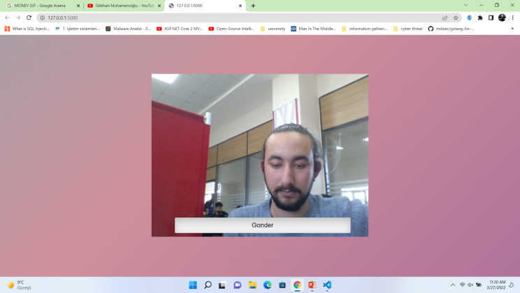
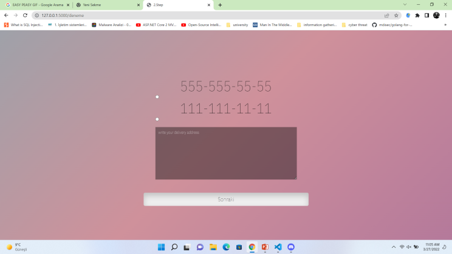
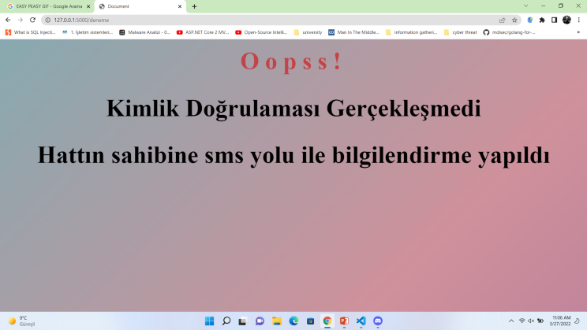

# Vodafone_Hackathon
sistemimiz simcard kayıp çalıntı durumlarında oluşacak kimlik sahtekarlığını önlemek için  yüz doğrulama ile bunun önüne geçmeyi hedeflemiştir.
aşağıdaki resimde gördüğünüz gibi sistem kayıtlı olmaayan kişiyi tespit ettiğinde hata ile karşılaşıp false değer döndüren sayfaya yönledirme yapıyor

(false değer dönen sayfa)

Eğer sistem kimliği doğrularsa e-devletten fotoğraftaki kişiye ait telefon biliglerini gönderip seçenek sunuyor. ve adres bilgileri isteyip
yedek simcard müşterinin seçtiği adrese postalıyor

(true değer dönen sayfa)

